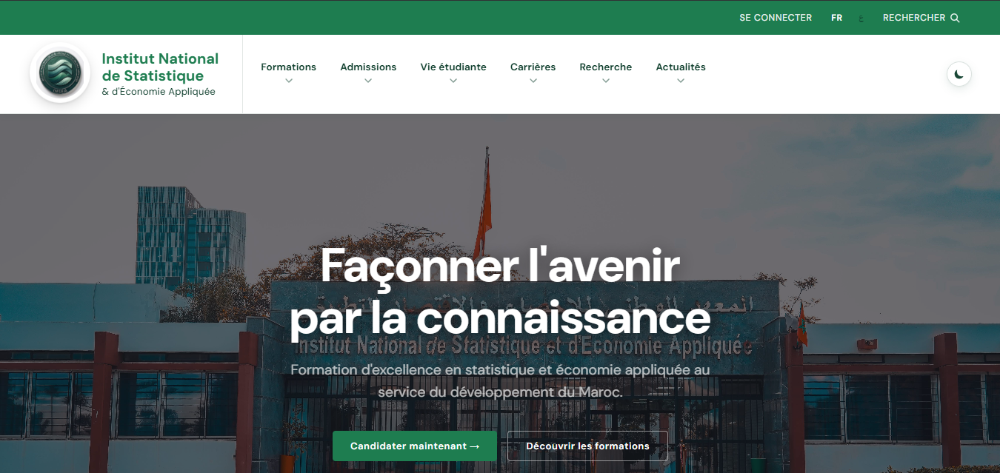
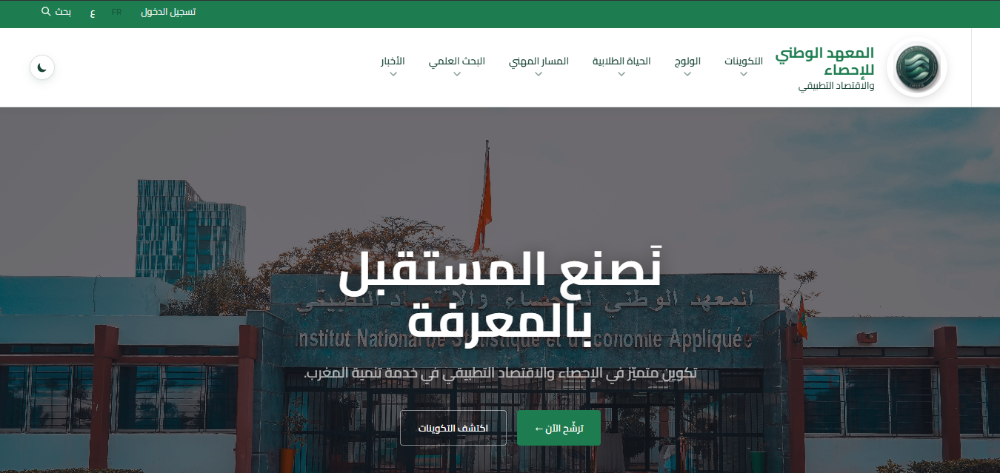
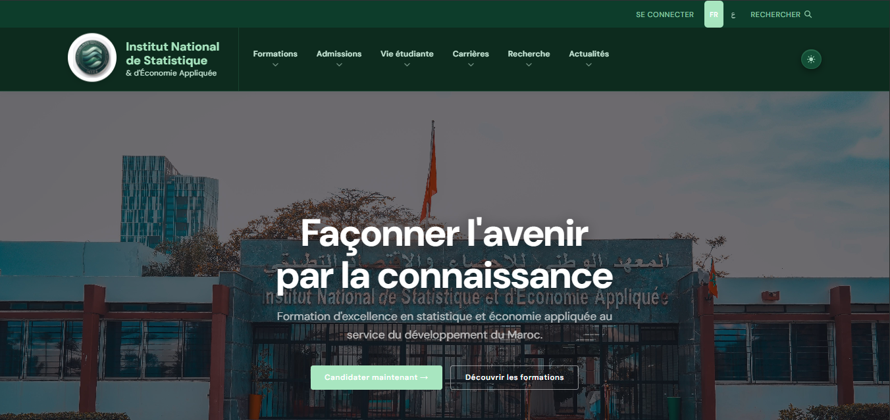
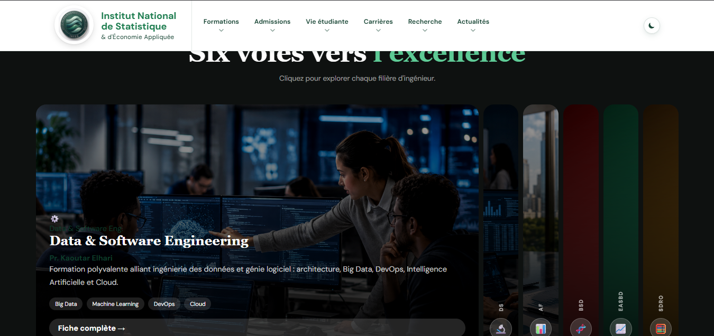

# INSEA Website

A bilingual (French / Arabic) website for the **National Institute of Statistics and Applied Economics (INSEA)**. Built with plain PHP, HTML, CSS, and JavaScript — no framework.


---

## Features

- **Bilingual French / Arabic**, switchable in one click (Arabic flips the whole layout right-to-left)
- **Light and dark mode**
- **Responsive** — works from mobile to desktop
- Sticky navigation bar with dropdown menus
- Auto-scrolling partners banner
- Interactive "Programs" section (click a panel to expand it)
- Subtle scroll animations

## Tech stack

PHP · HTML5 · CSS3 · JavaScript (vanilla). Fonts: [DM Sans](https://fonts.google.com/specimen/DM+Sans) + [Cairo](https://fonts.google.com/specimen/Cairo) (Google Fonts). No dependencies, no build step.

## Project structure

```
Page_principale/
├── home.php          # Main page (FR/AR, sessions, translation dictionary)
├── styles/           # One CSS file per area (navbar, marquee, sections, cards, footer, base)
├── JS/               # navbar, footer, sections, cards
├── images/           # Campus photos and partner logos
├── formations/       # Program pages (.html)
├── admissions/       # Admissions pages (.html)
├── vie-etudiante/    # Student life pages (.html)
├── carrieres/        # Careers pages (.html)
├── recherche/        # Research pages (.html)
└── actualites/       # News & events pages (.html)
```

## Run it

Requires PHP 7.4 or newer.

**With XAMPP**
1. Put the project in the `htdocs` folder.
2. Start **Apache**.
3. Open `http://localhost/Insea/Page_principale/home.php`.

**With PHP's built-in server**
```bash
php -S localhost:8000
```
Then open `http://localhost:8000/home.php`.

## How the bilingual part works

All text lives in a translation dictionary with two versions, French and Arabic, sharing the same keys. PHP picks the right one and remembers the choice in a session, so it stays the same across pages. For Arabic, the page also adds `dir="rtl"` to flip the layout and loads a dedicated font. Adding a new language just means adding one more set of translations.

## Screenshots

| Home — French | Home — Arabic (right-to-left) |
|:---:|:---:|
|  |  |

| Dark mode | Programs section |
|:---:|:---:|
|  |  |

## Author

Built by **Lechguer Zakaria** for a Web Development project.

## License

Academic project — MIT recommended.
